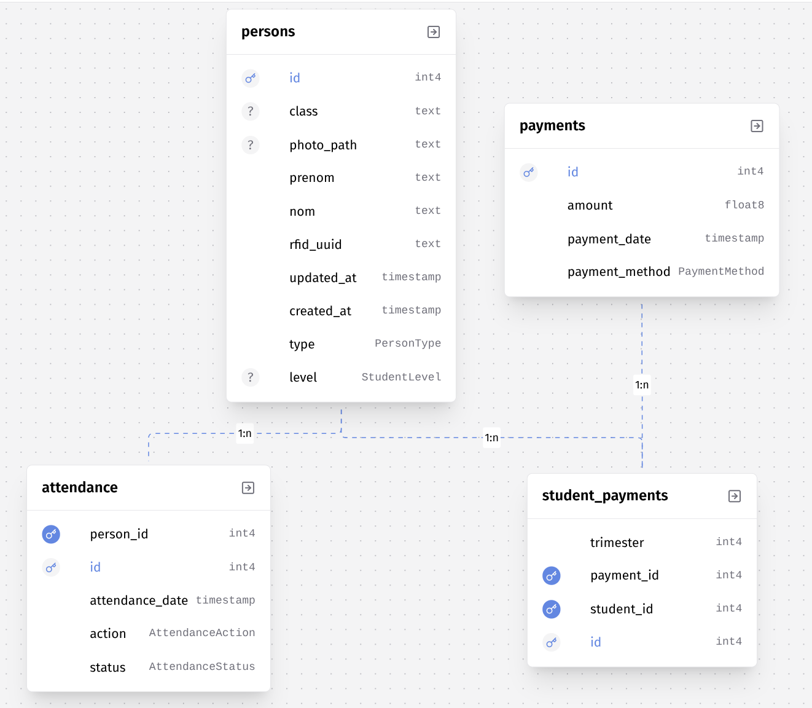

# Database Documentation

## Introduction to Prisma

Prisma is a modern ORM (Object-Relational Mapping) that simplifies database access. It provides:

- **Type Safety**: Automatic TypeScript type generation based on your schema
- **Migrations**: Automatic database migration management
- **Prisma Studio**: Graphical interface to visualize and manage your data
- **Query Builder**: Intuitive API to interact with the database

In this project, Prisma is configured to use PostgreSQL as the database.

## Prisma Configuration

The `prisma/schema.prisma` file contains the complete definition of the database structure. Here is the base configuration:

```prisma
generator client {
  provider = "prisma-client"
  output   = "./generated"
}

datasource db {
  provider = "postgresql"
}
```

- **Generator**: Configures Prisma client generation in the `./generated` folder
- **Datasource**: Specifies that we use PostgreSQL as the database management system

## Database Visualization

### Prisma Studio

Prisma Studio is a visual tool that allows you to explore and modify your database directly from your browser. To use it:

```bash
npx prisma studio
```

This command opens a web interface (usually on `http://localhost:5555`) where you can:

- View all tables and their data
- Add, modify, or delete records
- Explore relationships between tables
- Filter and search data

### ERD Diagram (Entity-Relationship Diagram)

The diagram below represents the complete database structure with all relationships between tables:



## Database Structure

The database consists of **4 main tables** and **5 enumerations** that define custom data types.

---

## Data Models

### 1. Person (Table: `persons`)

The `Person` model represents a person in the system. It can be a student, teacher, staff member, or visitor.

#### Fields

| Field        | Type            | Description              | Constraints                                                 |
| ------------ | --------------- | ------------------------ | ----------------------------------------------------------- |
| `id`         | `Int`           | Unique identifier        | Primary key, randomly generated between 1000000 and 9999999 |
| `rfid_uuid`  | `String`        | Unique RFID identifier   | Unique, required                                            |
| `type`       | `PersonType`    | Person type              | Enum: student, teacher, staff, visitor                       |
| `nom`        | `String`        | Last name                | Required                                                    |
| `prenom`     | `String`        | First name               | Required                                                    |
| `photo_path` | `String?`       | Photo path               | Optional, unique                                            |
| `level`      | `StudentLevel?` | Education level          | Optional, enum (only for students)                          |
| `class`      | `String?`       | Class                    | Optional                                                    |
| `created_at` | `DateTime`      | Creation date            | Automatically generated on creation                         |
| `updated_at` | `DateTime`      | Update date              | Automatically updated                                       |

#### Relations

- **One-to-Many with Attendance**: A person can have multiple attendance records
  
  ```prisma
  attendance Attendance[]
  ```

- **One-to-Many with StudentPayment**: A student can have multiple payments
  
  ```prisma
  student_payments StudentPayment[]
  ```

#### Model Code

```prisma
model Person {
  id         Int           @id @default(dbgenerated("1000000 + floor(random() * 9000000)::int"))
  rfid_uuid  String        @unique
  type       PersonType
  nom        String
  prenom     String
  photo_path String?       @unique
  level      StudentLevel?
  class      String?
  created_at DateTime      @default(now())
  updated_at DateTime      @updatedAt

  attendance       Attendance[]
  student_payments StudentPayment[]

  @@map("persons")
}
```

#### Detailed Explanations

- **`@id`**: Defines this field as primary key
- **`@default(dbgenerated(...))`**: Generates a random ID between 1000000 and 9999999 directly in the database
- **`@unique`**: Ensures value uniqueness (for `rfid_uuid` and `photo_path`)
- **`@default(now())`**: Sets the current date as default value on creation
- **`@updatedAt`**: Automatically updates this field on every modification
- **`@@map("persons")`**: Maps the Prisma model `Person` to the SQL table `persons`

---

### 2. Attendance (Table: `attendance`)

The `Attendance` model records presence/absence events for people in the system.

#### Fields

| Field             | Type               | Description                  | Constraints                     |
| ----------------- | ------------------ | ---------------------------- | ------------------------------- |
| `id`              | `Int`              | Unique identifier            | Primary key, auto-incremented   |
| `person_id`       | `Int`              | Reference to person          | Foreign key to `persons.id`      |
| `action`          | `AttendanceAction` | Action type                  | Enum: in, out                   |
| `status`          | `AttendanceStatus` | Action status                | Enum: success, failed           |
| `attendance_date` | `DateTime`         | Event date and time          | Automatically generated         |

#### Relations

- **Many-to-One with Person**: Multiple attendance records belong to one person
  
  ```prisma
  person Person @relation(fields: [person_id], references: [id], onDelete: Cascade)
  ```
  
  - **`onDelete: Cascade`**: If a person is deleted, all their attendance records are also deleted

#### Model Code

```prisma
model Attendance {
  id              Int              @id @default(autoincrement())
  person_id       Int
  action          AttendanceAction
  status          AttendanceStatus
  attendance_date DateTime         @default(now())

  person Person @relation(fields: [person_id], references: [id], onDelete: Cascade)

  @@map("attendance")
}
```

#### Detailed Explanations

- **`@default(autoincrement())`**: Automatically generates a sequential ID (1, 2, 3, ...)
- **`@relation(...)`**: Defines the relationship with the `Person` model
  - `fields: [person_id]`: Local field used for the relation
  - `references: [id]`: Referenced field in the `Person` model
  - `onDelete: Cascade`: Cascade deletion

---

### 3. Payment (Table: `payments`)

The `Payment` model represents an individual payment in the system.

#### Fields

| Field            | Type            | Description         | Constraints                     |
| ---------------- | --------------- | ------------------- | ------------------------------- |
| `id`             | `Int`           | Unique identifier   | Primary key, auto-incremented   |
| `amount`         | `Float`         | Payment amount      | Required                        |
| `payment_method` | `PaymentMethod` | Payment method      | Enum: cash, card, bank_transfer |
| `payment_date`   | `DateTime`      | Payment date        | Automatically generated         |

#### Relations

- **One-to-Many with StudentPayment**: A payment can be associated with multiple students (via the junction table)
  
  ```prisma
  student_payments StudentPayment[]
  ```

#### Model Code

```prisma
model Payment {
  id             Int           @id @default(autoincrement())
  amount         Float
  payment_method PaymentMethod
  payment_date   DateTime      @default(now())

  student_payments StudentPayment[]

  @@map("payments")
}
```

#### Detailed Explanations

- **`Float`**: Data type for decimal numbers (monetary amounts)
- This model stores general payment information, which can then be associated with specific students via `StudentPayment`

---

### 4. StudentPayment (Table: `student_payments`)

The `StudentPayment` model is a **junction table** (join table) that associates students with payments. It allows managing payments by trimester for each student.

#### Fields

| Field        | Type  | Description            | Constraints                      |
| ------------ | ----- | ---------------------- | -------------------------------- |
| `id`         | `Int` | Unique identifier      | Primary key, auto-incremented     |
| `student_id` | `Int` | Reference to student  | Foreign key to `persons.id`      |
| `payment_id` | `Int` | Reference to payment  | Foreign key to `payments.id`     |
| `trimester`  | `Int` | Trimester number       | Required                         |

#### Relations

- **Many-to-One with Person**: Multiple student payments belong to one student
  
  ```prisma
  student Person @relation(fields: [student_id], references: [id], onDelete: Cascade)
  ```

- **Many-to-One with Payment**: Multiple student payments can reference the same payment
  
  ```prisma
  payment Payment @relation(fields: [payment_id], references: [id], onDelete: Cascade)
  ```

#### Model Code

```prisma
model StudentPayment {
  id         Int @id @default(autoincrement())
  student_id Int
  payment_id Int
  trimester  Int

  student Person  @relation(fields: [student_id], references: [id], onDelete: Cascade)
  payment Payment @relation(fields: [payment_id], references: [id], onDelete: Cascade)

  @@map("student_payments")
}
```

#### Detailed Explanations

- **Junction table**: This table enables a **Many-to-Many** relationship between `Person` (students) and `Payment`
- **`trimester`**: Allows associating a payment to a specific trimester for a student
- **Cascade deletion**: If a student or payment is deleted, associated records in this table are also deleted

---

## Enumerations (Enums)

Enumerations define custom data types with predefined values. They ensure data integrity by limiting possible values.

### 1. PersonType

Defines person types in the system.

```prisma
enum PersonType {
  student   // Student
  teacher   // Teacher
  staff     // Administrative staff
  visitor   // Visitor
}
```

**Usage**: `type` field in the `Person` model

---

### 2. AttendanceAction

Defines possible actions when recording attendance.

```prisma
enum AttendanceAction {
  in   // Entry
  out  // Exit
}
```

**Usage**: `action` field in the `Attendance` model

---

### 3. AttendanceStatus

Defines the status of an attendance action.

```prisma
enum AttendanceStatus {
  success  // Action succeeded
  failed   // Action failed
}
```

**Usage**: `status` field in the `Attendance` model

---

### 4. PaymentMethod

Defines accepted payment methods.

```prisma
enum PaymentMethod {
  cash          // Cash
  card          // Card
  bank_transfer // Bank transfer
}
```

**Usage**: `payment_method` field in the `Payment` model

---

### 5. StudentLevel

Defines education levels for students.

```prisma
enum StudentLevel {
  License_1  // Bachelor Year 1
  License_2  // Bachelor Year 2
  License_3  // Bachelor Year 3
  Master_1   // Master Year 1
  Master_2   // Master Year 2
}
```

**Usage**: `level` field in the `Person` model (optional, only for students)

---

## Table Relationships

### Relationship Diagram

```text
Person (1) ────────< (n) Attendance
  │
  │
  └─── (1) ────────< (n) StudentPayment (n) >─────── (1) Payment
```

### Relationship Details

1. **Person ↔ Attendance** (One-to-Many)

   - A person can have multiple attendance records
   - Each attendance record belongs to only one person
   - Cascade deletion: if a person is deleted, their attendance records are also deleted

2. **Person ↔ StudentPayment ↔ Payment** (Many-to-Many via junction table)

   - A student can have multiple payments
   - A payment can be associated with multiple students
   - The `StudentPayment` table adds additional information (trimester)
   - Cascade deletion on both sides

---

## Useful Prisma Commands

### Generate Prisma Client

After modifying the schema, generate the Prisma client:

```bash
npx prisma generate
```

### Create a Migration

To create a migration after modifying the schema:

```bash
npx prisma migrate dev --name migration_name
```

### Apply Migrations

To apply migrations in production:

```bash
npx prisma migrate deploy
```

### Open Prisma Studio

To visualize and manage data:

```bash
npx prisma studio
```

### Reset Database

⚠️ **Warning**: This command deletes all data!

```bash
npx prisma migrate reset
```

---

## Best Practices

1. **Always generate the client** after modifying the schema
2. **Create migrations** for each schema change
3. **Use Prisma Studio** to test and visualize data
4. **Validate data** before inserting (enums already guarantee some validations)
5. **Use relations** rather than manually managing foreign keys

---

## Usage Examples

### Create a Person

```typescript
import { PrismaClient } from './prisma/generated/client';

const prisma = new PrismaClient();

const newPerson = await prisma.person.create({
  data: {
    rfid_uuid: 'ABC123',
    type: 'student',
    nom: 'Dupont',
    prenom: 'Jean',
    level: 'License_1',
    class: 'L1-INFO-A'
  }
});
```

### Create an Attendance Record

```typescript
const attendance = await prisma.attendance.create({
  data: {
    person_id: 1000001,
    action: 'in',
    status: 'success'
  }
});
```

### Retrieve a Person with their Attendance

```typescript
const person = await prisma.person.findUnique({
  where: { id: 1000001 },
  include: {
    attendance: true,
    student_payments: {
      include: {
        payment: true
      }
    }
  }
});
```

---

## Conclusion

This database is designed to manage an RFID attendance system with payment tracking. The structure allows to:

- ✅ Manage different person types (students, teachers, staff, visitors)
- ✅ Record entries and exits via RFID
- ✅ Track payments by trimester for students
- ✅ Maintain referential integrity with cascade deletions
- ✅ Guarantee uniqueness of RFID identifiers and photo paths

For any questions or modifications, refer to the [official Prisma documentation](https://www.prisma.io/docs).
